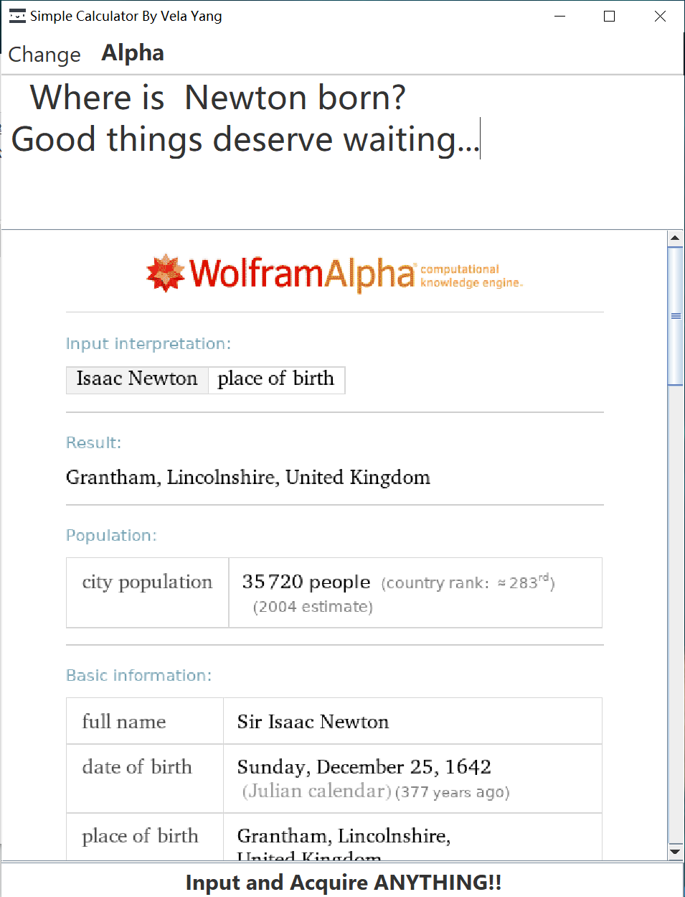
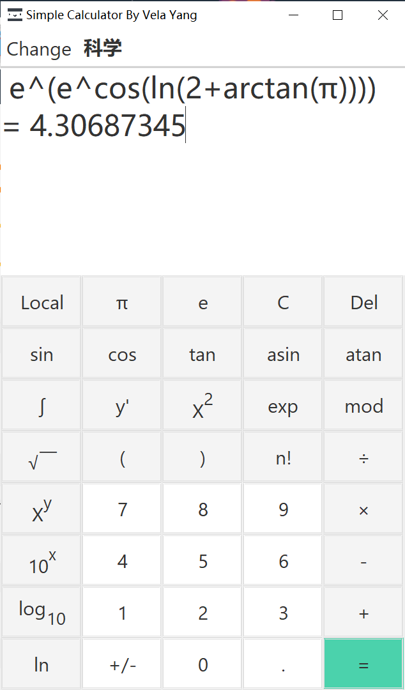
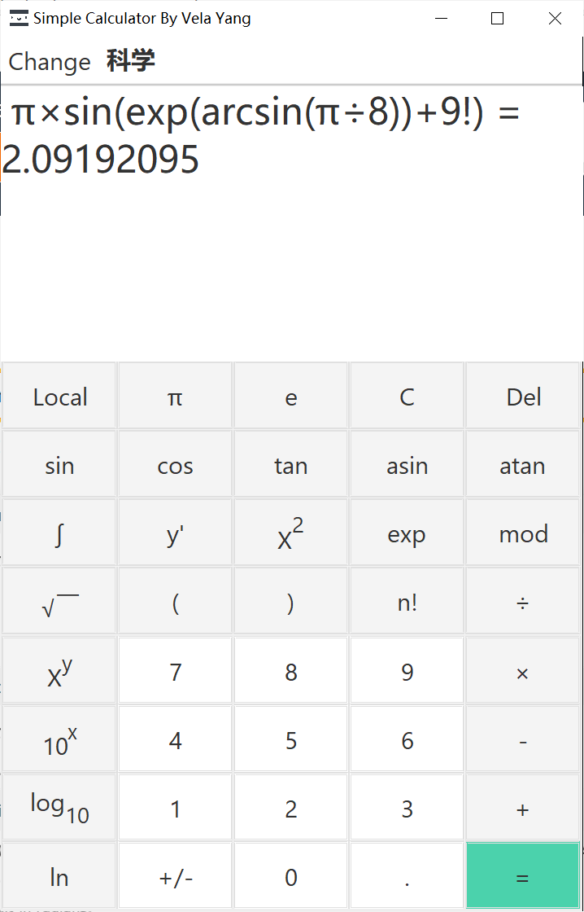
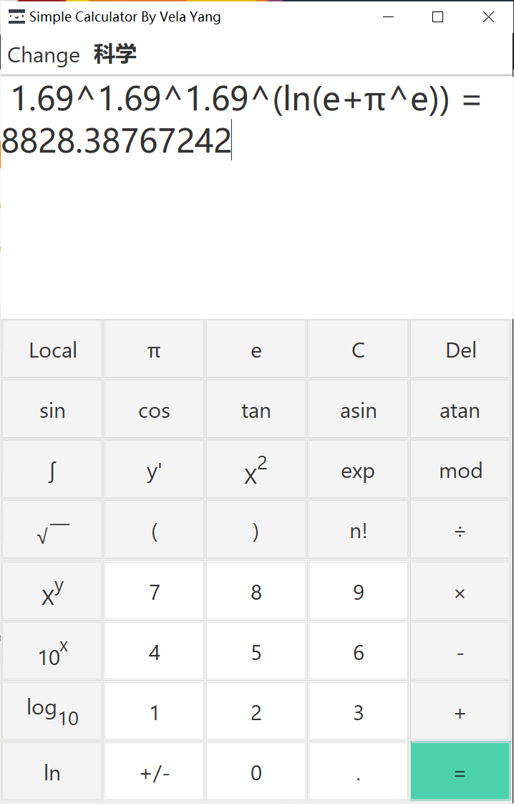
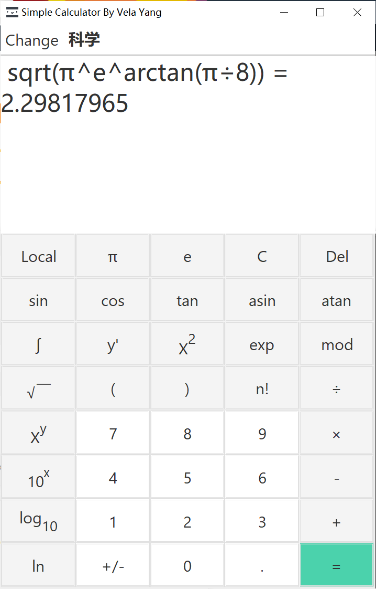

# Intelligent-Calculator
    使用Java与Wolfram Alpha API实现的智能计算器。
    可以用来计算基本算式、导数、不定积分、绘图等。
    运行方式：
    1. Simple Calculator By Vela Yang.exe
    2. 使用IDEA打开该文件夹并编译运行
    3. cmd导向至本目录，输入 java - jar "Simple Calculator By Vela Yang"
    功能展示：
    定积分
    
    不定积分
    
    求导
    
    问问题
    
    知识获取阶段
    
    
    
    
    本地计算器（无需联网）
    
    
    
    

 
